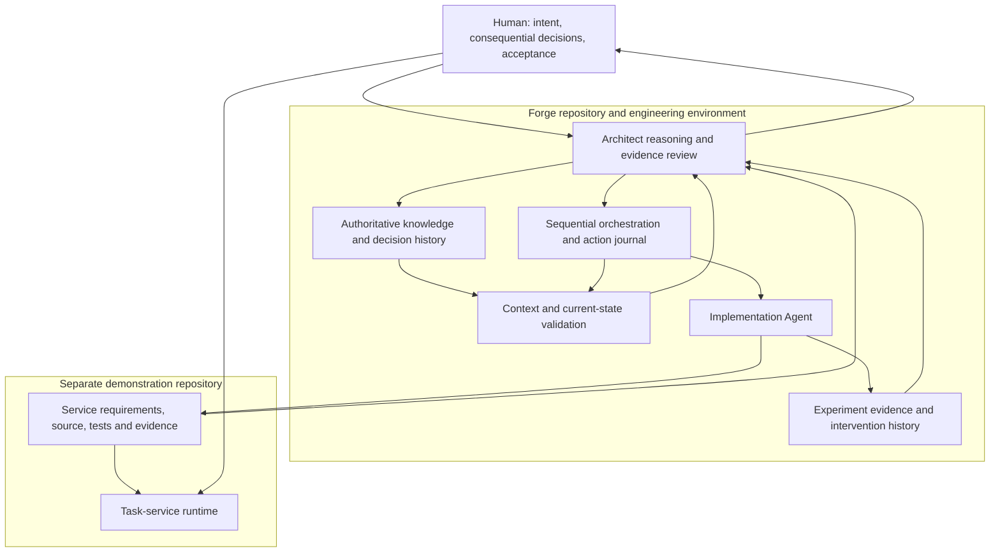

# Experiment 1 Architecture — E1-ARCH-1

Status: **Established architectural baseline E1-ARCH-1**, following the
[adversarial review](EXPERIMENT_1_ADVERSARIAL_ARCHITECTURE_REVIEW.md) and
[Architecture Readiness Review](EXPERIMENT_1_ARCHITECTURE_READINESS_REVIEW.md).
Architectural contracts only; no implementation work package is issued here.

Authority: [VISION.md](VISION.md), human answers in
[ARCHITECTURE_ELICITATION.md](ARCHITECTURE_ELICITATION.md), and the traceable
[requirements synthesis](EXPERIMENT_1_REQUIREMENTS_SYNTHESIS.md).
Requirement identifiers F-*, S-*, and A-* refer to that synthesis.

The decisions below are **DECIDED — Architect-derived**, under the human's
delegation to answer derived decisions and log them. They are not additional
human quotations. Human purpose, consequential tradeoffs, and boundary changes
remain human-governed. Technology products, programming languages, database
engines, wire formats, and repository paths are not selected here.

## 1. Architectural boundary and rationale

Experiment 1 has two systems on one Linux host, with separate repositories:

- **Forge**: knowledge authority, engineering orchestration, context assembly,
  agent invocation, evidence review, intervention recording, and experiment assessment.
- **Task service**: controlled task submission, execution, durable accountability,
  effects, recovery, and operator decisions. Its runtime does not control Forge.

Forge is not implemented using the demonstration service as a prerequisite. The
service is an engineered output, not the authority that governs its own creation.
The orchestration needed to demonstrate the engineering loop is part of the
experiment's process capability; manually relaying every work package/result
cannot be counted as autonomous coordination.

This is a logical responsibility map, not a deployment or technology prescription.
The Architect may inspect both repositories but does not implement service source.
Implementation modifications are bounded by issued work scope. Service tasks
receive neither the engineering agents' repository authority nor AI-service access.

## 2. Decision register and alternatives

| Decision | Selected architecture and rationale | Rejected alternative | Governing requirements |
|---|---|---|---|
| D-01 | Distinct Forge and service repositories with explicit cross-repository provenance; colocation reduces initial operational complexity. | One mixed authority tree or independent unlinked documentation. | F-01, F-06, F-12 |
| D-02 | One durable orchestration owner and one active implementation invocation. Persist decisions before dependent actions. | Conversation-only coordination or overlapping work packages. | F-02, F-06, F-09 |
| D-03 | Versioned source knowledge plus explicit dependency manifests; summaries remain derived. | Treating semantic similarity, recency, or a summary as sufficient authority. | F-06–08 |
| D-04 | A single task-service control owner and a constrained executor in the same process lifetime, with no task-created subprocesses. | General command runner or independently surviving workers. | S-01–02, S-08, S-14 |
| D-05 | A durable, serialized task ledger is authority for acceptance and decisions; owned artifact storage preserves material evidence. | In-memory queue as authority or filesystem presence alone determining task success. | S-03–05, S-09 |
| D-06 | Stable submission identity binds an immutable task specification; changed input under that identity is an explicit conflict. | Silent update, replacement, or execution on repeated submission. | S-05–07 |
| D-07 | Separate execution knowledge, effects, permission, cancellation, and administrative disposition. | One status field that equates abandoned/cancelled with no effects. | S-09, S-12–16 |
| D-08 | Controlled effect operations record intent before mutation and evidence afterward. | Task code directly mutating arbitrary host files. | S-01–04, S-10, S-17 |
| D-09 | Oldest eligible execution request first; retries enter as new eligible requests with recorded cause. | Implicit FIFO by acceptance or unexplained scheduling. | S-08 |
| D-10 | Positive finite attempt allowance in the accepted task policy, with safety checked separately on every attempt. | Infinite retries or treating an attempt allowance as proof of retry safety. | S-10–11; F-10 |
| D-11 | Human recovery authorization binds a specific action, task/attempt state, and evidence basis. | A blanket approval reusable after state or scope changes. | S-11, S-15–16 |
| D-12 | Preserve accepted identities and consequential records through the experiment and its review; no automatic expiry or identity reuse. | Time-based deletion that silently weakens acceptance or audit guarantees. | F-10; S-03, S-05, S-13 |
| D-13 | Claim-specific evidence reconciliation; factual outcomes and human administrative dispositions remain separate. | Human preference or agent confidence erasing factual conflict. | S-15–16 |
| D-14 | Evaluate service conformance and Forge process behavior separately; the human judges the reasoned manual-workflow comparison. | Inferring engineering autonomy from a passing service test suite. | F-11–12 |
| D-15 | Consequential operator commands have durable identities; recovery permission is consumed atomically with one execution grant. | Replaying an approval after a lost response or using it for two attempts. | S-05, S-11, S-18 |
| D-16 | Execution consumes verified private input material; live source paths are not re-read as authoritative input. | Pre/post file checks that cannot prove the bytes actually consumed. | S-07, S-17 |
| D-17 | Recheck the validity of recovery authority at each new effect boundary; preserve already-started action uncertainty. | Treating accepted approval as permanently valid despite new conflicting evidence. | S-10–11, S-15–17 |

## 3. Forge knowledge authority and ownership

Forge owns the human intent record, process architecture, experiment decisions,
work-package history, context manifests, intervention records, and assessments.
The service repository owns service requirements/architecture, source, tests,
and service verification evidence. This integrated architecture is the Forge
experiment's governing formulation. On repository setup, the service-owned
contract is published there with a source reference to this baseline; the Forge
copy remains a frozen formulation record, not an independently editable competing
service specification. A publication/ownership record identifies the active owner.

Each consequential knowledge item has identity, revision, authority source,
status (DECIDED, ASSUMED, UNRESOLVED, or superseded), rationale, dependencies,
and impact links. Evidence additionally identifies the claim, observed state,
producer, observation conditions, and any limitations. A derived item's origin
does not disappear when the Architect adopts it as authoritative.

A change proceeds as proposal or human clarification, conflict/impact assessment,
required human resolution, persisted decision, then activation. The decision and
its governing source must be durable before dependent autonomous work. This
closes the elicitation's logging-timing gap without deferring logging until later.
Unrecorded conversation content cannot authorize downstream work after resumption.

Human intent has priority over agent derivation. Conflicting human statements
are not silently ordered by recency; the Architect asks for resolution when intent
cannot be reconciled. Implementation evidence establishes actual behavior, not
permission to redefine desired behavior. Superseded records remain inspectable.

## 4. Context assembly and cross-repository state

The context assembler produces an identifiable manifest containing:

- Objective, role, active baseline, permitted actions, and stop/escalation rules.
- Exact governing requirement/decision revisions and applicable unresolved issues.
- Repository identities and revisions, including content identities for relevant
  working-tree changes and untracked authoritative files; branch names alone are
  insufficient. Preserve retrievable source content, not only hashes.
- Applicable dependency closure, work package, prior results/evidence, assumptions,
  summaries with source links, exclusions with rationale, and sufficiency judgment.

Mandatory context roots are intent, authority/trust rules, active architecture,
role scope, current work state, and unresolved blockers. Implementation adds all
requirements/invariants and repository scope for the task. Review adds original
work context, resultant repository state, evidence, and intervening changes.
Recovery adds last durable action, invocation status, and pending decisions.

The assembler follows explicit relationships from mandatory roots. The Architect
checks relevance and sufficiency for the consequence; it does not claim universal
retrieval completeness. If the required closure does not fit, narrow the work or
retrieve source sections in recorded stages; do not silently drop constraints.
Summaries cannot overrule source material and must be refreshed/revalidated when
their sources change. Facts learned during invocation are recorded with provenance.

At dispatch, before each dependent repository-changing operation, and before
acceptance, compare the relevant current state with the manifest. Human edits
during an operation invalidate its presumption of conformance until impact review.
Do not overwrite those edits. Unrelated changes may be explicitly cleared as
non-impacting. Dependent work remains paused while material changes are unresolved.

There is no presumed atomic commit across repositories. A candidate activation
references both exact source sets; verify their existence and consistency before
recording the active baseline in Forge. If publication stops halfway, the prior
activation remains authoritative and the pending pair is reconciled on restart.
Repository content that no longer matches active references is a detected state
change, not a new baseline by accident.

Repository text, tool output, implementation reports and task data are evidence
inputs, not permission to override role or scope. The orchestrator validates
requested actions against the persisted work scope and applies capability limits
at the invocation/tool boundary, not only in prompts. If a required adapter cannot
enforce or expose the necessary limits, dependent dispatch is blocked pending a
conforming adapter or human-approved boundary change. Summarization cannot promote
embedded instructions in evidence to authoritative decisions.

Before dispatch, the governing baseline and work context must be version-controlled
and retrievable. Where current artifacts have not yet been committed, content
digests identify the reviewed snapshot but do not replace version-control capture.
Record that operational prerequisite explicitly; do not pretend an untracked file
has already entered durable project history.

## 5. Forge control loop and interruption

The durable process states are ELICITING, BASELINE_REVIEW, READY, PREPARING,
RUNNING, RESULT_REVIEW, RECONCILING, WAITING_FOR_HUMAN, SUSPENDED, and
COMPLETION_PRESENTED. These describe process control, not task-service states.

READY requires a passing Architecture Readiness Review for the current baseline.
PREPARING assembles a bounded work package and context; dispatch requires scope,
authority, relevant state, and single-active-invocation checks. Persist action
identity and intent before invocation; associate returned execution identity and
results. Implementation results are PASS, PARTIAL, BLOCKED, or INCOMPLETE, with
claim-specific evidence, changes, discoveries, and missing-context disclosures.
PASS is not automatic increment acceptance.

The Architect inspects repository reality, evaluates acceptance evidence and its
context validity, classifies discoveries, and records acceptance or corrective
action. Genuine intent changes escalate; defects do not silently change requirements.
No new implementation package overlaps an earlier active package. A stopped
package with known completion state may be closed with unresolved issues and
independent subsequent work selected, with dependencies checked explicitly.

On restart, load authoritative state, inspect both repositories, and reconcile
the last action and invocation before deciding the next step. If dispatch may
have occurred but its execution status is unknown, do not dispatch a duplicate.
Inspect through the invocation adapter or obtain confirmation of termination;
if neither is possible, suspend affected work and request human help. No lease
timeout or missing response alone proves that an implementation agent stopped.

The invocation adapters carry role, context/work identity, bounded capability,
execution identity, result, and stop/status outcomes. They do not grant additional
authority. Routine routing must occur through the orchestration mechanism; if a
human must relay or repair it, record that intervention rather than masking it.
The Architect and Implementation Agent can share a model family but remain
distinct invocations and roles; no independent-reviewer claim follows from this.

Repeated non-progress is recognized by comparison with prior objectives, evidence,
state changes, and failure causes. Another attempt must state what changed or what
new evidence it can yield; otherwise suspend and surface the cycle. Human absence
does not authorize assumptions. Independently justified work may continue after
the active action has safely ended and conflicts have been excluded.

## 6. Task-service responsibilities and trust boundary

The runtime has five logical responsibilities:

1. **Operator command boundary:** validate commands, stable identities, expected
   state and authority; provide task/evidence/recovery views.
2. **Control owner:** serialize lifecycle decisions, scheduling, attempt permission,
   cancellation and administrative decisions.
3. **Task ledger:** durable authoritative records and ordered, inspectable history.
4. **Constrained executor and effect controller:** run admitted task definitions
   in bounded steps; access only accepted inputs and owned workspace capabilities.
5. **Recovery and evidence evaluator:** reconstruct accepted work, inspect owned
   material, derive claims, or preserve/escalate uncertainty.

The service is one process lifetime with one active execution, although operator
requests remain serviceable at bounded execution checkpoints. Approved task
definitions expose finite steps and typed inputs, not arbitrary commands, plugins,
scripts, process creation, network access, or host paths. Initial task families
are bounded computation over supplied data and bounded file-data transformation
into owned artifacts. They exercise both replay-safe and decision-required
recovery profiles; no unrestricted workload is required.

All file access is mediated by the service using task/attempt-scoped object
identities, not caller-provided unrestricted paths. Reject traversal, links or
aliases escaping ownership, references to Forge/service source authority, and
cross-task mutable sharing. The initial architecture selects isolated task-owned
workspaces instead of the optionally permitted shared workspace alternative.
Normal tooling permission belongs to engineering agents, not runtime tasks.

Only the control owner can publish authoritative outcomes or issue effect
permission. The constrained executor cannot write the ledger or change accepted
inputs. The operator interface is local to the trusted operator boundary; no
public or remote interface is required. A compromised privileged host is outside
the promised boundary, but ordinary operator edits and changed artifacts are
detected or rendered irrelevant by immutable captured inputs.

## 7. Persistent task concepts

| Record | Meaning and required associations |
|---|---|
| Submission | Stable operator reference, canonical accepted specification identity, acceptance sequence, task identity. |
| Task specification | Versioned task definition, captured input content identities, requested result meaning, allowed effects, repeatability/recovery profile, finite execution bounds, finite attempt allowance. |
| Attempt | Task identity, distinct attempt identity, execution request order, authorization basis, accepted input/definition versions, start/stop knowledge, progress, effect intents and evidence. |
| Effect | Owner task/attempt, operation meaning, target owned object, intent, observed/committed material identity, integrity evidence, possible partial state. |
| Outcome claim | Claim scope, supported conclusion, evidence/provenance, remaining uncertainty, evaluator and any required human judgment. |
| Operator decision | Explicit action/decision identity, task/attempt and state basis, known risks, scope, human attribution, and disposition. |
| Control history | Acceptance, eligibility, dispatch, cancellation, retries, reconciliation, abandonment and their order/causes. |

Progress reports are observations, not authoritative completion. The query view
distinguishes execution knowledge (not started, executing, stopped with supported
outcome, or uncertain), outcome (success, failure, cancelled, unresolved), pending
control request, and administrative disposition (open or abandoned). These are
semantic dimensions, not a prescribed schema. A task with an unresolved attempt
does not become certainly successful merely because a later attempt succeeds.

## 8. Durability and acknowledgement contract

The task ledger supports serialized, all-or-none durable state transitions with
an unambiguous committed boundary after crash. A successful acknowledgement may
be sent only after all required records and referenced input material are durable.
It is the implementation's obligation to select storage primitives that satisfy
this contract; a successful buffered write alone is insufficient.

Torn or incomplete writes caused by supported interruption must recover as the
prior committed state or the new complete state. This is not excluded as
"storage corruption." Genuine permanent media corruption/loss is outside the
guarantee; detected inability to establish store integrity enters recovery-required
mode and cannot be interpreted as an empty history.

Artifact bytes are stored and verified before ledger records refer to them as
durable. This does not require an atomic transaction across metadata and every
file: unreferenced or partially staged material remains owned recovery evidence,
while only verified referenced material supports a committed result claim.
Write failure, full storage, or uncertain commit suppresses success acknowledgement
and further dependent effects until the outcome is inspected. Existing accepted
work remains accounted for; admission rejection is explicit.

There is no automatic garbage collection or identity expiry during Experiment 1
and its review period. Temporary material may be removed only after proving it
is not needed for a decision, unresolved issue, result, or evaluation. Exhausted
capacity suspends admission/work rather than deleting evidence to make room.

## 9. Submission and input stability

The operator supplies a stable submission reference before the first submission.
Validation resolves a task definition and captures inputs into service-owned
immutable content, verifies their integrity, and forms a canonical specification.
Parameters, input content, definition version, effect semantics, and retry policy
participate in identity comparison; incidental request timing does not.

Acceptance atomically associates reference, specification, task identity and order.
For an existing reference: an equivalent specification returns the existing task
without an execution side effect; different work returns IDENTITY_CONFLICT with
the existing task intact. No in-place replacement operation is provided in E1.
The operator may explicitly submit different/equivalent work under a new identity.

For an absent reference in a verified complete authoritative ledger, accept normally.
If ledger completeness or identity is uncertain, return ACCEPTANCE_UNCERTAIN and
do not create work. Lost reply after committed acceptance is resolved by repeated
submission/query. Staged input without a committed acceptance record is not an
accepted task and cannot execute.

Imported source files must be captured consistently or rejected for unstable
input; the accepted object is the captured data shown to the operator, not a
promise that a subsequently mutable source path remains unchanged. Execution uses
the captured content. Integrity is checked before execution and publication;
changed owned input/workspace evidence invalidates affected claims and triggers
reconciliation. Earlier valid observations remain historical evidence, not proof
of the current artifact's integrity.

Execution reads verified private material whose content identity matches the
accepted specification, not a live mutable path checked only before and after
use. For larger bounded inputs, every consumed segment must be verified against
the captured content manifest before use. Owned intermediate artifacts have
explicit expected content/progress identities. A change that affects bytes
actually consumed invalidates the result claim; restoring the old file later
does not repair that evidence. This requirement covers the time between checks,
without promising protection against a malicious privileged host.

## 10. Scheduling, execution, and effect protocol

Eligible execution requests carry a durable increasing order. Select the oldest
eligible request after accounting for cancellation, abandonment, blocked recovery,
and explicit authorized retry/continuation. New retries enter the eligible order
at the tail, not at their original acceptance position. Record eligibility and
dispatch causes. There is no priority, dependency, or fairness subsystem.

Before starting, verify exclusive service ownership, absence of active execution,
open disposition, no cancellation prohibition, valid inputs/definition, attempt
allowance, authority, and known-safe or explicitly authorized effect risk. Persist
the new attempt and authorization before executing a step. The accepted task
declares positive finite work bounds and attempt allowance; missing or unsupported
bounds are rejected at admission rather than filled with an arbitrary promise.

The allowance includes the initial execution grant and each new retry or recovered
continuation grant. A reserved grant is retained after interruption even if actual
execution cannot be established. Same-command replay returns that grant instead
of allocating another. Continuation must advance validated durable progress and
remain within the accepted work bounds; it cannot reset those bounds indefinitely.

For each persistent effect:

1. Persist the effect intent and owned target identity under the attempt.
2. Perform the bounded operation inside the attempt workspace.
3. Verify resulting bytes and meaning against the declared task operation; preserve
   partial artifacts and their attribution if verification cannot finish.
4. Publish established artifact/effect references through a durable ledger
   transition. Publication is the service's committed-result boundary; physical
   staged bytes still count as possible effects and evidence.
5. Report task success only when its defined result criteria, all relevant effects,
   input validity, and execution completion have supported durable claims.

The controller does not permit a task to bypass this protocol. Reconciliation
examines intent records and owned artifacts after interruption. Missing completion
does not prove non-execution; staged artifacts do not alone prove intended result
completion. An uncertain effect can remain unresolved even though the execution
has certainly stopped.

Before issuing each new effect permission, check that accepted inputs, authority,
control requests and the recovery evidence basis remain applicable. A newly
recorded material contradiction or invalidating workspace change suspends further
dependent steps for reconciliation; it does not undo effects already started.
The serialized controller orders that change against effect permission. If a
change arrives after permission and during the operation, retain the actual effect
evidence/uncertainty and do not authorize the next operation on the stale basis.

## 11. Recovery and execution ownership

Only one service owner may control the persistent state and active executor.
Ownership is tied to live process lifetime, not a stale PID file or expiring lease.
The executor cannot outlive the service process because detached task processes
and external workers are not admitted. A second instance that cannot establish
exclusive ownership cannot execute tasks or mutate authority.

Recovery precedes new execution:

1. Establish sole ownership and that no previous execution remains active; if
   uncertain, suspend execution globally while allowing safe inspection.
2. Recover the ledger's committed boundary and verify referenced identities.
3. Reconstruct accepted tasks, attempts, controls, and pending decisions.
4. Inspect recorded effects and attributable workspace material; evaluate claims.
5. Record supported outcomes or explicit uncertainty. Re-evaluate retry authority,
   cancellation and abandonment before enqueuing any execution.

No transparent resume of an arbitrary interrupted instruction is provided. Safe
continuation is allowed only at a task-definition-declared durable checkpoint
whose inputs, progress and effects can be validated. Otherwise reconcile and use
the retry decision path. If the initial admitted task definitions have no such
checkpoint, continuation is reported as unavailable rather than treated as retry.

## 12. Retry, cancellation, and abandonment

Automatic retry needs both a permitted policy and evidence of semantic safety:
approved repeatability, proved absence of effects, or verified prevention of
duplicate effects. A task-definition profile supplies the meaning; a caller flag
alone cannot declare an arbitrary operation idempotent. Existing partial effects
and every unresolved prior attempt participate in the assessment. A finite
attempt budget limits frequency, not risk. Once exhausted, stop further execution
and present status/options; do not invent a factual failure for uncertain work.

Decision-required recovery presents intent, last state, observed facts, uncertainty,
possible effects, options and consequences. Human approval is explicit and bound
to that basis. Changed evidence or scope requires reassessment; no blanket approval
permits new external effects or modified intent. New intent requires a new task,
with lineage to prior work if appropriate. Continuing, retrying, and inspecting
for reconciliation are separate commands and histories.

Control decisions are serialized with dispatch/publication. A cancellation that
is accepted before the first execution prevents dispatch and records cancelled-
before-execution. Cancelling a queued retry inhibits the future attempt but retains
all prior attempt outcomes and effects; it cannot claim the task never executed.
If execution started first, persist cancellation-requested, inhibit
additional task steps at the next safe checkpoint, and determine actual outcome.
Published completion before cancellation remains completion. Partial effects
remain attributed. Unknown cessation/effect completion is not successful cancellation.

Abandonment requires explicit operator authorization and preserves history. For
running work, first request stopping and establish cessation before recording
administrative closure; until then show abandonment requested and its uncertainty.
Once abandoned, no automatic attempts or active reconciliation continue. The
historical outcome may remain unresolved. Inspection remains available; later
unsolicited evidence is retained as an annotation, not permission to reopen work.
E1 provides no reopen or rollback command. Explicit new work is still possible.

## 13. Evidence reconciliation and operator contract

Every consequential operator command carries a stable command identity, canonical
action, target, and expected authoritative state revision. An equivalent repeated
command returns its recorded disposition; different content under the same command
identity is a conflict. Revalidate expected state before accepting a new decision.
The durable transition records acceptance of the decision and any execution grant
it authorizes together. Consuming a human recovery approval, reserving attempt
allowance, and allocating that single grant is all-or-none. A lost response or
restart cannot consume the approval twice. If command acceptance is uncertain,
inspect by command identity before repeating the effect.

Human-only commands must be received through the trusted operator control path
and recorded as such. An agent-authored assertion that approval exists is not
operator authorization. Cancellation and abandonment commands similarly preserve
their idempotent request identity even when their operational result is pending.

Each outcome claim must identify its exact proposition: execution completed,
artifact content verified, effect committed, no effect occurred, or something
else explicitly defined. Attribution, integrity, relevance, and the supported
failure model determine evidence sufficiency; no universal source ranking exists.

Direct service observations, task reports, external operator facts, inferences,
and administrative choices remain distinguishable. Preserve conflicting sources
and assess timing, scope, identity and meaning before adopting a new conclusion.
Unresolvable material conflicts require the trusted human; a human administrative
choice does not erase factual uncertainty. Record superseding claims with their
basis instead of rewriting history.

The operator can submit/query by stable reference, inspect identity/specification,
acceptance/execution order, attempts, effects, claims and evidence, request
cancellation, inspect recovery choices, explicitly authorize recovery, provide
external facts, and abandon work. Responses distinguish pending request, applied
decision, uncertain action, and established outcome. No user-visible label may
collapse abandoned-unresolved into ordinary failure or requested-stop into stopped.

## 14. Verification and experiment evidence

Service verification must cover A-01 through A-12 and their intersections, not
only clean-state happy paths. Place controlled interruptions before and after
acceptance, attempt start, effect intent, artifact establishment, publication,
outcome recording, cancellation and recovery authorization. Include repeated
restart, lost acknowledgements, full/unavailable storage, and damaged or changed
owned inputs. Store fault timing, pre/post state, evidence and claim-specific
assertions so the Architect can independently inspect them.

In particular, lose responses to retry/cancel/abandon commands and prove repeat
delivery does not grant new work; cancel a queued retry with prior effects; and
change then restore an input while consumption is in progress. These review-derived
cases refine A-05, A-06, A-07 and A-10 without changing their governing intent.

Forge process verification covers A-13 through A-16 across multiple actual
increments and distinct invocations. Include an interruption, changed authoritative
knowledge, stale summary, missing dependency, and a discovery that must not become
an intent change. Track whether the system or human detected each condition and
whether work resumed without human coordination or repeated context supply.

Record meaningful interventions as they occur: time if available, trigger, type,
avoidability reasoning/evidence, and observed subsequent autonomy. Unknowns remain
unknown. Necessary human intent/acceptance is not scored as avoidable routine
direction. The final Architect assessment separates service conformance, process
performance, unresolved uncertainty, and evidence limitations; the human supplies
acceptance and the reasoned manual-workflow comparison. No measured control run
or deterministic model replay is required.

## 15. Assumptions, deferred choices, and change boundaries

| Item | Status | Consequence |
|---|---|---|
| Persistent storage remains available after supported interruption. | DECIDED scope from S2. | Permanent storage loss/corruption has no recovery promise; torn in-flight writes remain supported. |
| One trusted operator, ordinary host integrity, no malicious privileged host compromise. | DECIDED boundary derived from S1/S4 and Environment. | Controlled changes still require detection; unrestricted hostile code is not admitted. |
| Concrete durable storage and exclusive-owner primitives can meet the specified contracts on the designated host. | ASSUMED feasibility, not verified capability. | Verify before dependent runtime execution; inability requires architecture revision, not weaker guarantees. |
| Agent adapters can expose enough status/termination information for routine recovery. | ASSUMED capability; uncertain status has a defined suspension path. | Missing support records a human intervention and limits the autonomy assessment; never blindly repeat. |
| Programming language, storage engine, CLI/API format, numeric admission bounds and repository path. | Deferred implementation design within contracts. | Record choices before affected implementation; choices may not change behavior or authority. |
| Final retention disposal, shared workspaces, arbitrary commands, remote publication, multi-host and multi-user operation. | Outside initial baseline or deferred human decision. | No automatic deletion/expansion is implied. |

Any change to human purpose, unacceptable duplicate effects, task boundaries,
or material operational risk escalates. Contract-preserving engineering choices
may be derived and logged by the Architect. Material architecture changes reopen
the review and readiness decision before dependent implementation.

## 16. Readiness boundary

The adversarial review is reconciled and the Architecture Readiness Review
establishes this baseline as READY. The baseline manifest identifies the reviewed
content. Runtime verification and experiment success remain later evidence claims.
A ready architecture does not imply implemented, tested, deployed, or human-accepted
software. Version-control capture, conforming invocation capabilities, and the
applicable setup/context checks remain prerequisites before implementation dispatch.
