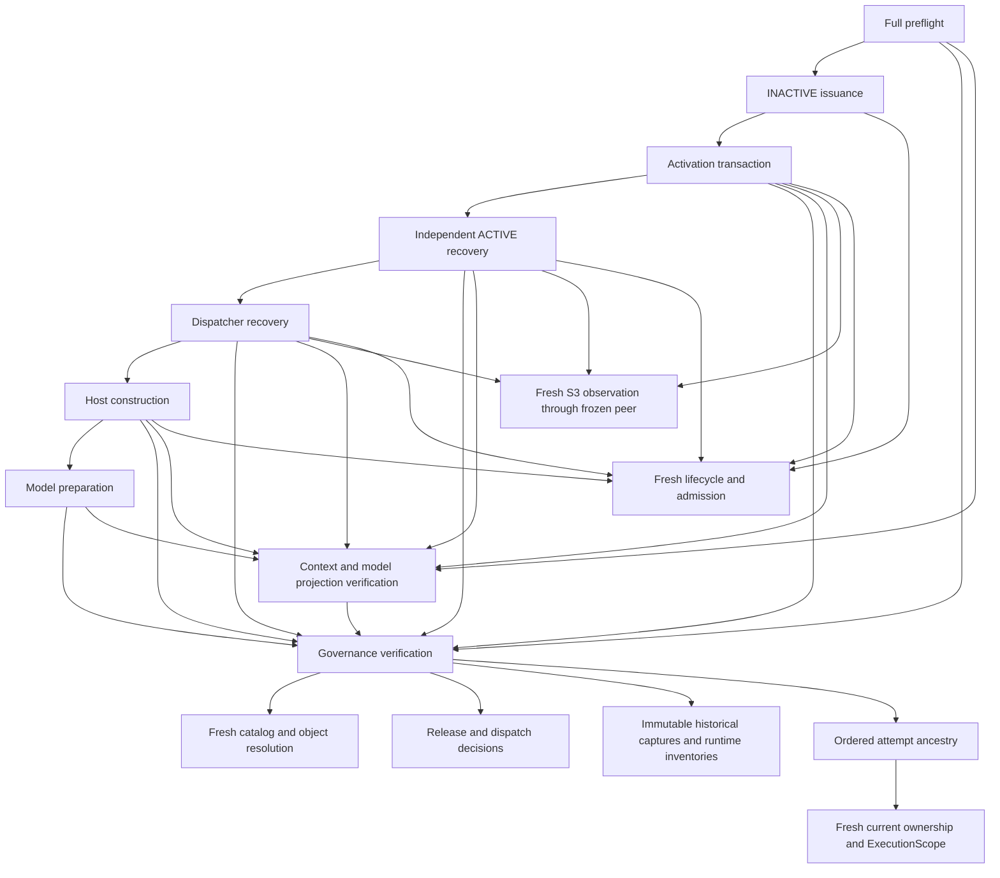

# Run-2 control-plane remediation — staged, not production qualified

**Verdict: BLOCKED. `RUN2_CONTROL_PLANE_READY_FOR_NEXT_ATTEMPT` is not established.**

This package diagnoses r12 and stages focused corrections. It does **not** establish complete actual-context pre-model performance, complete live status coverage, or an applicable production implementation continuation. No authority record was applied. No r13 identity, authorization, namespace, ownership, or model request was created. No E1-WP-001 execution occurred.

The current production validator correctly rejects this staged runtime as `unaccounted runtime`. That check was preserved. Primitive benchmarks against the actual pinned store and synthetic lifecycle timings below must not be represented as acceptance of the complete amended production path. Completing the authenticated implementation/context integration and its actual-context timing qualification remains necessary.

## Preserved evidence and current state

The 69 files in r12's sealed evidence manifest, the prior immutable files in its historical baseline, the applied runtime, and the current ownership ledger were checked without modification. See `HISTORICAL_PRESERVATION.json`. The shared ledger is compared with r12's terminal digest, not its earlier pre-activation digest.

Independent read-only recovery through the unchanged applied verifier establishes:

* r12: `CANCELLED`, admission closed, ownership absent, no ExecutionScope, no unresolved action/effect uncertainty.
* Existing semantic predecessor policy returns `ACTIVE_CANCELLED_PRE_MODEL_NO_EFFECTS`. No policy extension or attempt-number exception is necessary for r12.
* This is eligibility evidence only, not permission for a successor.
* Exact S3 remains READY: `SupervisorInstance-sha256:83f22718a56ab733257208c6e1dfe9767a95e0d10b82f8583f222f88ee9669a2`, through succession `SupervisorSuccession-sha256:b86bbb15d9d9d468b2de87926ad6b1cb4063218fd71eb5426089f689c0aecce8`. The fresh probe rechecked PID 1465900, parent 1465890, implementation/interpreter, workspace, cgroup, socket identity and current succession binding.

`R12_PREDECESSOR.json` contains the fresh terminal reconstruction; `CURRENT_PROFILE.json` contains the fresh S3 result.

Current authority is unchanged:

* Release: `E1-RELEASE-AUTHORITY-sha256:84b7294bef3e2ccdbae8364b66f202135fcc9def9dd0081b473f847b4636628d`.
* Context: `E1-OPERATIONAL-CONTEXT-sha256:a59e21566098fee1756bbe991f74e0d2c8c5b756a76d90877911c35d57044a8a`.
* Ancestry: `ddf509e2283fe93aa9bb9b857a45dc449ff5ca309c66f9bdfd18c45dcf2dedfd`.
* ModelPayloadDigest: `d675d581c80f43e691a31da73ccf17fd4bcc6b00d3a5331f26b9294e294e1538`.

## Latency dependency graph

`DEPENDENCY_GRAPH.json` records input identities, represented authority, classification, freshness requirements, prior verified basis, invocation sites and duration sources for each expensive dependency. `R12_COSTS.json` records measured nested spans. This graph is engineering evidence, not operational authority.

Observed repetition in r12:

| Operation | Calls | Inclusive measured seconds |
|---|---:|---:|
| Attempt-history decision | 124 | 17.103 |
| Historical capture verification | 124 | 107.189 |
| Attempt-history ancestry | 124 | 18.126 |
| Model projection | 14 | 54.567 |

These spans overlap enclosing operations. Their totals are **not** additive to phase durations. Also, span-start/end persistence occurs outside parts of the measured inner interval; the uninstrumented remainder cannot all be attributed to history work.

The repeated work is primarily full authority composition, not the semantic evidence classifier. Profiling the unchanged current verifier recorded 705 `_verify_catalog` calls across bootstrap, three history-verification calls, and one projection derivation. Whole-byte SHA-256 work dominated that sample. Each resolve rereads and hashes the large catalog, even when its exact bytes have just been verified. Historical witnesses, projection construction and the frozen supervisor peer repeatedly reconstruct overlapping evidence.

No lifecycle, ownership, scope, admission, uncertainty, current head or live supervisor result is suitable for blanket reuse. A further cross-phase reusable result must bind all immutable dependencies and retain fresh checks of those mutable facts. **Such a complete cross-phase mechanism has not been implemented or qualified in this package.**

## Staged corrections

The five changed modules are listed with old/new hashes in `IMPLEMENTATION_DELTA.json`. Staged runtime identity:

`sha256:6243cd00763051c08eb2ecd456e38bc4856c79101596aaabc39f2f14e2165f26`

1. **Catalog verification:** hash the original catalog against the externally pinned digest at construction, then compare each newly read catalog byte-for-byte with those verified bytes. Every access still rereads the file, checks descriptor/directory identity, applicability, grants and private-state placement. Object hashes and current mutable facts are unchanged. This reuses a verified immutable value, not a prior authorization verdict or filesystem timestamp.
2. **Closed-telemetry cancellation:** typed `ActivationTransaction.cancel` runs its existing authority and transaction checks without an admission-gating timing sink. Exhausted telemetry cannot prevent the very cancellation it requests. Admission stays closed; the sink is restored on return; authority checks, uncertain-effect handling, exclusive ownership and durable terminal/release writes remain unchanged.
3. **Observation-stable status snapshots:** a byte-identical audit prefix may be followed by a hash-valid suffix containing only records accepted by the existing trusted observation schema. The ledger must still be unchanged. Unknown/malformed evidence, model/effect records, lifecycle changes, admission closure and budget exhaustion require a new snapshot. The status result records both audit hashes and whether observation-only growth occurred. This grants no handoff authority.
4. **Byte-buffer telemetry decoding:** `decode_events(bytes)` exposes the existing hash/order checks to the status snapshot comparison. `events(path)` still freshly reads the file and invokes the same checks.

## Qualification and timing limits

Focused qualification includes automatic pre-model hard-exhaustion cancellation, closed admission after cancellation, terminal recovery, uncertainty retaining ownership, observation-only status growth, unknown/effect/restriction negatives, catalog tampering, unchanged no-progress behavior, synthetic model boundary, nested-session rejection, session-boundary recovery and terminal status dominance. The exact test result is in `QUALIFICATION.json` and its log.

The staged candidate's 25 existing run-control/authority-store regressions pass in 34.017 seconds. Bubblewrap's namespace test required the host-capable test environment. The initial sandbox run is retained separately and is not counted as candidate qualification.

**Historical r12 production timing, unchanged:**

| Phase | Seconds |
|---|---:|
| Pre-issuance validation | 26.556 |
| Activation transaction | 58.319 |
| Independent ACTIVE recovery | 69.358 |
| Dispatcher activation recovery | 56.707 |
| Host construction | 65.667 |

These five named phases total 276.607 seconds, excluding other preparation and boundary work. The first provider request was never reached. Five soft warnings and the 300-second no-progress exhaustion remain historical facts.

**Fresh component measurements on actual pinned authority:**

| Measurement | First sample | Subsequent samples |
|---|---:|---|
| Applied catalog, 100 fresh checks | 0.732s | 0.733 / 0.696 / 0.652s |
| Staged catalog, 100 fresh checks | 0.207s | 0.208 / 0.209 / 0.208s |
| Applied bootstrap, profiled | 3.497s | Not a cold-cache guarantee |
| Applied history verify, profiled | 1.103s | 1.249 / 1.225s |
| Applied projection, profiled | 3.635s | One sample |
| Applied fresh S3 readiness | 13.527s | One sample |

The profiler adds overhead. A first process sample is not a claim that host filesystem caches were cold.

**Complete synthetic path to fake model boundary:** 8.564 / 9.516 / 8.336 / 8.744 seconds. The first sample used a newly constructed fixture, followed by three additional samples. Each fixture used non-E1 authority, a synthetic supervisor and a fake provider callback. Per-phase timing is in `SYNTHETIC_TIMING.json`; automatic terminal cleanup followed. These numbers are not actual-context production timing and do not establish the requested margin for E1.

**Complete corrected actual-context cold/warm and cumulative timing: NOT ESTABLISHED.** The staged code correctly fails the frozen production runtime pin. It would be incorrect to bypass that pin, reuse r12's closed invocation, or present the synthetic numbers as production acceptance.

## History scalability

All original r8–r12 audit bytes were included. Their warm hash/order decoding costs are approximately 1.18, 2.13, 1.77, 43.60 and 36.91 ms respectively: 85.59 ms total. r12's semantic classifier adds 21.8–22.1 ms. See `HISTORY_COST.json`.

Decoding is approximately linear in total record bytes, with no truncation or new authoritative checkpoint. This does not establish constant-time complete ancestry verification: repeated historical store/witness reconstruction remains a larger problem. An authenticated immutable dependency result plus current delta remains a proposed next optimization, not an implemented claim.

## Nine UNKNOWN observations

`UNKNOWN_STATUS_ANALYSIS.json` identifies every snapshot, its hash, duration, recorded reason, and overlapping durable operations.

* Three FileNotFoundError observations: 3.212, 3.160, 3.172 seconds, before issuance. The monitor attempted lifecycle projection before the audit existed. The old exception record did not preserve the missing filename; absence of the audit is a chronology/code-supported diagnosis, not a retained file-error traceback.
* Four UNSTABLE_SNAPSHOT observations: 36.355, 41.124, 42.088, 43.380 seconds. The old projection retried when either the entire audit or ledger changed. Its retry evidence does not identify which comparison changed on each retry. Repeated observation telemetry is a demonstrated sufficient cause, but cannot be claimed as the exclusive cause of every historical retry.
* Two PROJECTION_DEADLINE observations: 30.962 and 31.871 seconds. Repeated reconstruction exhausted the projection's 30-second deadline. Per-retry inner timing was not retained.

The staged suffix correction passes the synthetic concurrent-observation probe and preserves terminal authority dominance. **Explicit useful pre-issuance projection, actual-context phase coverage, and bounded status availability throughout every cancellation/activation boundary remain unqualified.** They are readiness blockers.

## Progress semantics and applicability

The released five-minute no-progress policy and all other thresholds are unchanged. Repeated validation/activity does not reset progress in the staged tests. No new controller transition is currently counted as substantive progress.

Counting verified one-time issuance, ownership acquisition, ACTIVE establishment, independent ACTIVE recovery or dispatcher authority establishment would alter stopping semantics: it can extend the absolute time to no-progress cancellation. Treat that as a **material budget-semantic proposal**, requiring authenticated transition identities, durable deduplication across restart and rejection of caller-asserted progress. No such policy was applied or claimed qualified here.

Separate applicability assessments:

| Change | Assessment |
|---|---|
| Exact catalog-byte reuse | Non-material implementation candidate: same bytes/pin/placement checks, no authority verdict cached |
| Typed cancellation without admission-gating observation | Non-material implementation candidate: restores cancellation; existing authority/uncertainty predicates retained |
| Observation-stable status | Non-material implementation candidate: projection only, trusted schema, no effect authority |
| Cross-phase validated-state composition | Not yet implemented/qualified; no final applicability verdict |
| New substantive controller progress resets | Material budget-semantic change if adopted; proposal only |

No continuation, new context, material amendment or release identity has been published for these staged changes. The existing schema-7 runtime qualification pins the applied implementation and its precise historical delta. A properly authenticated applicability path for the corrected implementation remains necessary; weakening that check is not an acceptable shortcut.

## Remaining closure work

1. Complete content/dependency-bound validation composition across adjacent phases, with current facts verified freshly.
2. Qualify its implementation/context binding without reopening r12 or creating a real successor.
3. Measure the complete actual-context path, multiple warm samples, with each normal preparation phase below 30 seconds and cumulative margin below 300 seconds.
4. Complete pre-issuance and all-transition operator-status coverage, including deadline and source diagnostics.
5. Qualify cancellation at the remaining early-construction/transition failure boundaries; the passing automatic cancellation probe covers an established transaction and host before provider handoff, not every possible interruption point.
6. Decide and qualify any proposed material controller-progress semantics separately; do not silently reset or extend budgets.

There were zero new real model/provider requests, zero new E1 ActionRequests/executions/effects, and no new invocation or ownership. Staged engineering code and non-E1 fixture evidence are the only new artifacts. Experiment 1 acceptance is not asserted.
