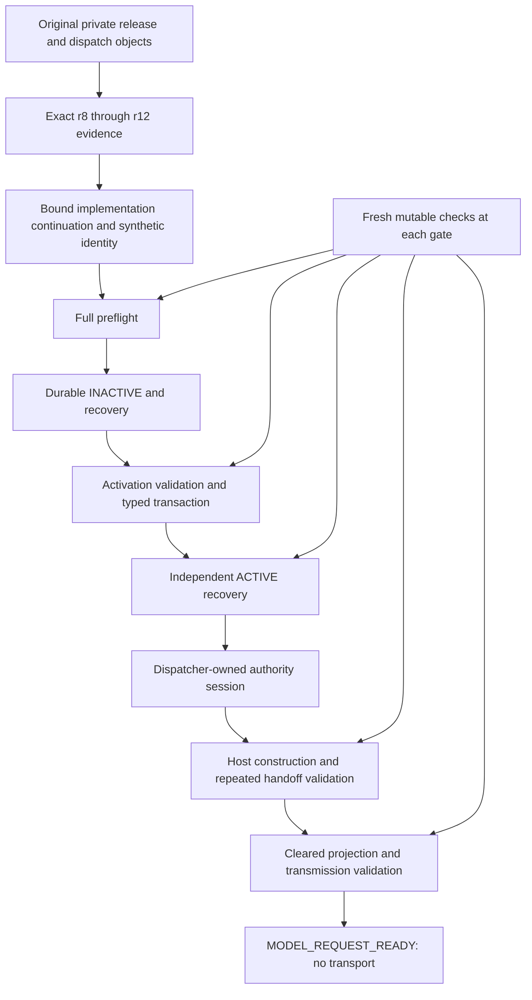

# Validation composition and reuse contract

The qualification scope is finite and private: five synthetic identities under the current r12 release authority. It reuses original authority objects and the full immutable r8–r12 capture. It does not mint a real successor, model-request permission, tool permission, or replacement ownership in the real shared ledger.

| Reused result | Exact dependency and implementation binding | Producer → consumers | Freshness and invalidation |
|---|---|---|---|
| Parsed authority catalog | Private store root, externally pinned catalog SHA-256, owner/mode/placement, exact catalog bytes | Store construction → resolutions in the same store/session | Catalog and placement freshly observed; changed bytes fail before effects. No catalog head can be chosen by a caller. |
| Pure resolution batch | Store identity and current pinned catalog; each logical object is still read and hashed | Outer pure context/derivation predicate → nested pure predicates | Catalog checked at entry and exit; no authority effect allowed inside batch. Object substitution fails on the individual read. |
| Parsed historical catalogs | Exact predecessor-publication store configuration and pinned catalog | Outermost authority session → historical witness checks within that session | Every borrow verifies the catalog. Every witness object and mutable source is freshly read. Pool is destroyed at session exit. No lifecycle/ownership verdict is cached. |
| Phase-local historical verification | Exact content-addressed predecessor captures/publication pins, complete original object witnesses, source/runtime hashes and ancestry | First genuine history verification in a pure phase → repeated equivalent history checks within that phase | Original full history predicate executes at both boundaries. Results are locally produced, defensively copied and discarded at scope exit. Changed/missing dependencies reject the phase before a result escapes. Current lifecycle/ownership predicates still execute independently. |
| Original supervisor authority reconstruction | Continuation-evidence-pinned private content-addressed verification representation consumed by the shared ordinary attempt-chain/qualification verifier; original publication; full immutable witness including inner history witness; original runtime inventory; producer script/interpreter/schema; source inputs; exact succession ledger bytes/head | Original released-runtime cold reconstruction → preflight, activation, recovery, host and handoff validation | All dependency bytes and current succession head revalidated each use. Exact process birth/parent, executable, UID/GID/groups, workspace, cgroup, socket/listener/environment and current scope/readiness observations repeated before and after each check. A saved READY is never consumed as current readiness. |
| Telemetry prefix hashing state | Exact freshly reread byte prefix; local verified sequence/previous/hash state; held audit descriptor identity | Prior append → next append on the same RunControl | Only byte-identical prefix reused. New suffix fully checked. Prefix change triggers full verification; malformed/order/hash changes fail. Four-MiB cap; independent restart reconstructs from the complete durable bytes. Every append still fsyncs. |

No externally supplied validation PASS is accepted. The bound continuation inventories every changed implementation file. Private selected bindings pin the exact finite synthetic slots and original release authority. The supervisor verification representation is evidence of pure verification, not new supervisor authority or an authoritative checkpoint replacing original records.

Mutable/current facts are never reused as verdicts: admission, lifecycle, current exact reservation and ledger identity, execution scope, unresolved effects, authority/attempt head, repository/context inputs, and current supervisor observations remain fresh. Lifecycle changes use existing typed transactions, after pure verification returns. Dispatcher owns its own non-nested session.

Substantive-progress semantics are unchanged. Issuance, activation, recovery, validation, warning persistence, and status polling do not acquire new progress-reset semantics. Qualification pauses only at the pre-request stop for the hard-budget case; its released no-progress deadline still expires normally.

The independent process restarts deliberately discard process-local caches. Original evidence remains necessary for every cold reconstruction. A qualification binding cannot be converted into a real invocation: provider and governed-effect boundaries explicitly reject it, including attempted direct calls.
