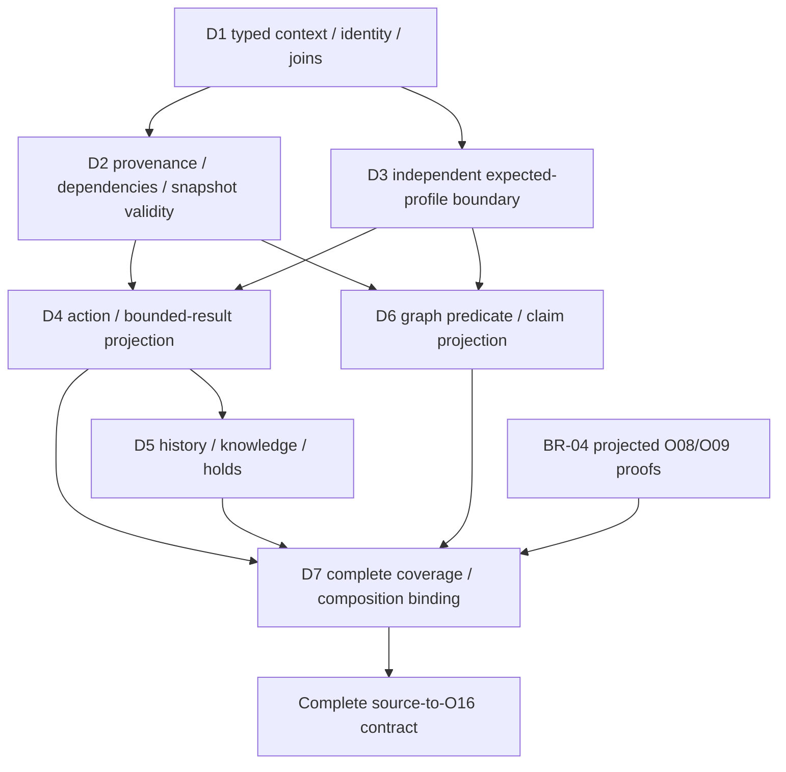

# CE-02 remaining bridge dependency analysis 1

**Analysis complete; bridge closure remains incomplete.** BR-01, BR-02, BR-03 and BR-05 share missing identity/context, provenance/dependency and independent-profile bindings. They also have three distinct semantic projection obligations: action/results, history/holds and graph claims. Closing a shared envelope alone cannot close them.

**Full source-to-O16 restoration from frozen sources is CONDITIONAL.** The target must be faithful restoration of the suspended state, including unsatisfied evidence requirements. It is not a requirement to make those requirements true. No new real external evidence is needed merely to represent their recorded absence. Complete independently governed projections and qualification are still required; this analysis does not prove that every necessary normalization is already defined.

The [machine-readable dependency and closure plan](DETERMINISTIC_PLANNER_V0_1_CE02_REMAINING_BRIDGE_DEPENDENCIES_1.json) contains input identities, eighteen source-availability records, eight blocker records, six backward routes, four interface cut members, five proposed packages, and all eight external evidence boundaries. It does not modify an oracle or schedule execution.

## Evidence and scope

Governing inputs are the [original bridge analysis](DETERMINISTIC_PLANNER_V0_1_CE02_SOURCE_PROFILE_BRIDGE_1.md), [partial gap closure](DETERMINISTIC_PLANNER_V0_1_CE02_BRIDGE_GAP_CLOSURE_1.md), their complete machine companions, the [preflight specification](DETERMINISTIC_PLANNER_V0_1_C06A_3_PREFLIGHT_CLOSURE_1.json), the current [CE-01 executable specification](DETERMINISTIC_PLANNER_V0_1_CE01_CONTRACT_RECONCILIATION_1.json), unchanged [O08](DETERMINISTIC_PLANNER_V0_1_O08_VALIDATOR_AUTHORITY_GATE_ADMISSION_1.json) and [O09](DETERMINISTIC_PLANNER_V0_1_O09_BASELINE_SLOT_PROOF_ADMISSION_1.json), the [bounded O03 contracts](DETERMINISTIC_PLANNER_V0_1_C06A_2_ORACLES_1.json), and [remaining-contract scope](DETERMINISTIC_PLANNER_V0_1_C06A_REMAINING_CONTRACT_1.md).

Source aliases:

- P: [resolution plan](../experiments/E1/E1_TEMPLATE1_GRAPH_RESOLUTION_PLAN_1.json).
- G: [typed graph](../experiments/E1/E1_TEMPLATE1_TYPED_KNOWLEDGE_GRAPH_1.json).
- M: [resume manifest](../experiments/E1/E1_RESUME_MANIFEST_1.json).
- H: [handoff](../experiments/E1/E1_EXTERNAL_HANDOFF_PACKAGE_1.json).
- S: [checkpoint](../experiments/E1/E1_SUSPENSION_CHECKPOINT_1.json).

Read-only inspection confirms 63 plan actions, 24 history records, 343 graph entities and 962 assertions spanning 15 relationship kinds. The bounded inventory remains 16 owners, nine source classes and 2,733 assigned field records. BR-04's three documentary positives, 30 negatives, nine invalidations and four partial composition cases are retained as prior evidence, not reclassified as full restoration or rerun qualification.

### Owner inventory versus supporting sources

M `/execution_result_artifacts` explicitly names 23 raw-hash-pinned artifacts. All 23 files exist and their hashes verify. Four are among the 16 owners; **19 are named frozen dependencies outside that owner set**. Reading them through those exact references is different from unconstrained repository discovery or acquiring new external evidence. Their byte verification does not yet qualify per-event semantic joins.

M's canonical extracted identities for P `/execution_history`, `/execution_state` and `/selection_policy` all verify. The ledger digest, plan raw digest, embedded policy digest and policy-document raw digest are separate identities. S `/bindings/selection_policy_document` supplies the last binding. A bridge must preserve this distinction; it must not use `QUAL-LEDGER-BASE` or equate the two policy hashes.

## Normalization of every open gap

### BR-01 — action definitions and bounded results

**Source route:** P `/resolution_actions/*` plus named accepted result documents, including S-BINDING, S-CONTEXT and PREP-VALIDATOR. **Target:** O01 typed action definitions and O03 bounded result candidates, subsequently consumed by O02/O06 and O16.

**Successful stages:** owner recognition, source pin/selector extraction; existing bounded synthetic result oracles. **First failed stage:** source semantics to the complete independently governed typed definition/result profile. No full source-to-O01/O03 positive has been established by BR-04.

- **Missing inputs:** not action names or effect strings, which exist; the complete accepted expected definition/result parameter set does not exist as a machine artifact.
- **Missing mappings:** prose `acceptance_criteria`, `authority_rule`, completion exclusions and current knowledge requirements to exact result outcomes, knowledge types, authority requirements and independent root/slot transitions.
- **Missing joins:** ActionId + exact plan selector + result identity/document + governing acceptance rule. Named document availability does not establish the semantic correspondence automatically.
- **Missing envelope bindings:** action scope (`READINESS_PLAN` where recorded) and actionability restrictions to the typed contract, separately from the runtime REQUEST envelope. Do not replace one with the other.
- **Missing provenance:** source pointer/hash and extraction/admission basis for each normalized requirement, including source dependencies of accepted knowledge.
- **Missing currentness:** complete role-specific snapshot-validity/dependency projection; existing invalidation rules are available. A new TTL or generic freshness rule is not needed.
- **O16 requirement:** exact admitted action inventory and bounded results under a separately accepted profile; no candidate-generated allowlist and no PASS-to-root/slot shortcut.

**Feasibility: CLOSABLE_AFTER_CONTRACT_DEFINITION**, conditional on a complete reviewed finite mapping. This is not evidence that runtime subjects sought by acquisition actions exist.

### BR-02 — history, knowledge, holds and current overlay

**Source route:** P history/current state and result bindings, M ledger/state pins, and explicitly named result/override support. **Target:** O02/O06 normalized history, accepted result/knowledge records, holds, overrides and reconciled current summary.

**Successful stages:** source extraction and verification of ledger/state subvalue identities; referenced result bytes are available. **First failed stage:** classification/projection of heterogeneous history into operative events plus provenance-only history, with complete current reconciliation.

- **Missing inputs:** executable typed event/result/hold identity and reconciliation contract; the historical records themselves are present.
- **Missing mappings:** selection-only, action-result, accepted knowledge, blocked/hold and superseding-overlay cases. P `/execution_history/0` explicitly has `action_result=null` and no selected/executed action. The synthetic HISTORY row schema always names an action and result. A non-lossy disposition is needed; fabricating an action is prohibited.
- **Missing joins:** exact event selector to ActionId/result document and ledger; hold to its authoritative override and evidence source; accepted knowledge to its current support.
- **Missing envelope bindings:** actual ledger identity and record-specific scope/lineage to the current snapshot without promoting historical scope to current applicability.
- **Missing provenance:** causal event order, accepted result source and override basis. Filename order or last writer wins cannot resolve it.
- **Missing currentness:** which source dependency supports which current knowledge/hold/prerequisite, while retaining historical facts. Current proof does not require a BLOCKED producer to become COMPLETED.
- **O16 requirement:** `history()` checks ordered profile history, result inventory, context, override support and exact current summary. CE-01 also requires the evidence and override payloads themselves, not just their pin strings.

**Feasibility: CLOSABLE_AFTER_CONTRACT_DEFINITION.** No external evidence is required to preserve a blocked result. Positive reentry based on new facts remains a separate external boundary.

### BR-03 — source graph admission and projection

**Source route:** G entities/assertions, relation semantics, synchronization rules, prerequisite projection and explicitly referenced support. **Target:** O10 typed entities/assertions/predicates with accepted or descriptive dispositions and deterministic topology.

**Successful stages:** source extraction, IDs/triples/provenance and declared ordering flags are available. **First failed stage:** complete source relation/provenance to typed predicate/claim/admission projection.

- **Missing inputs:** a complete independently reviewed predicate/claim/acceptance table for the assigned source inventory. A typed predicate ID is not present merely because a relation string exists.
- **Missing mappings:** 15 source relationship kinds to preserved semantics and operative/non-operative dispositions; `SOURCE_LOCATED`, reported source roles and issued decision evidence to their exact supported claims.
- **Missing joins:** subject/object typed entities, predicate contracts, and each assertion's source raw identity + selector + extraction method + accepted support.
- **Missing envelope bindings:** graph and assertion scope/lineage to the instance; historical or descriptive subject references cannot be relabelled as currently applicable objects.
- **Missing provenance:** retained original source chains and the independent basis for accepting an operative claim. G has 1,312 `SOURCE_LOCATED` provenance entries, 64 reported-source entries explicitly lacking new currentness proof, and four issued-decision provenance entries. These are not one interchangeable acceptance class.
- **Missing currentness:** normalized transitive support graph implementing G `/synchronization`, including multi-source invalidation and append-induced revalidation. The governing rule already exists.
- **O16 requirement:** admitted O10 inventories, typed predicates, accepted/descriptive partition and deterministic edges; every mandatory operative field accounted. O10 accepts only declared profile relationships, so a full-source profile needs explicit relation semantics beyond the two kinds in BASE/RENAMED.

**Feasibility: CLOSABLE_AFTER_CONTRACT_DEFINITION**, not a license to mark all assertions accepted or all inconvenient assertions descriptive. If a required operative acceptance rule cannot be derived, that particular route remains blocked.

### BR-05 — trusted composed instance and coverage

**Source route:** P/G/M/H/S, complete assigned-selector inventory, all required projected components and BR-04 proof submissions. **Target:** O16 context, source roles/pins/dependencies, independently accepted profile, coverage and admission bindings.

**Successful stages:** raw source/context bindings and selectors are known; BR-04 projections compose with existing synthetic BASE/RENAMED components in two positive and two negative cases. **First failed stage:** independently governed full-source profile and complete source-to-component binding. Full source-to-O16 positives remain zero.

- **Missing inputs:** accepted full-source expected tables and field dispositions, not a new runtime authority grant.
- **Missing mappings:** assigned field to typed component versus legitimate provenance-only/explicitly unavailable state, with enforced holds where appropriate.
- **Missing joins:** checkpoint to manifest/plan/graph/ledger/policy; normalized sources to components; admission submission digests to exact graph/plan/envelope context; inherited support references outside the 16 owners.
- **Missing envelope bindings:** a real source-derived instance/ledger context and explicit correspondence for runtime/G4/invocation/profile and other references. A named subject is not a proof of its applicability.
- **Missing provenance:** complete coverage entries preserving source identity, selector, selected-value identity, destination and disposition under the projection version.
- **Missing currentness:** normalized validity/dependency roles whose meaning distinguishes current support of the frozen snapshot from actual current applicability of subjects. O16's `all(current(...))` must not be used to manufacture the latter.
- **O16 requirement:** exact source membership/pins, validity context, profile/coverage/admission bindings, all local admissions and O08/O09 submission checks. Local admission alone is insufficient.

**Feasibility: CLOSABLE_AFTER_CONTRACT_DEFINITION**, conditional on BR-01/02/03 and shared bindings. If the existing schema cannot express a necessary source disposition, record a specific incompatibility before changing it. This analysis has not established a new predicate contradiction.

## Backward trace and dependency graph

The JSON records the first missing interface on each of these six routes:

| O16 required member | Local admission | Typed projection and join | Source | First missing interface |
|---|---|---|---|---|
| `output.actions` | O01 `actions()` | definitions; ActionId + exact rule binding | P actions | source semantics → complete typed action contract |
| result source / action result contract | O03, then O02/O06 | bounded result; action/event/result-source join | P/M + named reports | document/result → independently admissible typed result |
| `output.history` | O02/O06 `history()` | event/result/hold/current summary; ledger and override joins | P history/state + M | heterogeneous history → lossless current reconciliation |
| `output.graph` | O10 `graph()` | entities/predicates/claims; source assertion joins | G + named support | source assertion → admissible typed predicate/claim |
| context/source validity | O16 `evaluate(INSTANCE)` | normalized roles, dependency DAG and context | P/G/M/H/S | pinned source relations → complete role/context projection |
| coverage/profile/admissions | O16 `compose()` | independent expected profile and field coverage | assigned inventory + components | projected components → trusted complete composed contract |



These are AND dependencies. D3 defines the independent acceptance boundary; the actual per-family expected tables are supplied by D4/D5/D6 and integrated by D7. This avoids making final composition a prerequisite of its own local projections. X1, the absent positive external facts, is deliberately outside this restoration DAG.

**Shared root blockers:** D1, D2 and D3. They affect all four open gaps. D4/D5/D6 are distinct semantic boundaries, not aliases for one envelope problem. D7 aggregates them and the preserved BR-04 route.

## Source availability and blocker types

The JSON's V01–V18 records make the distinction field-family by field-family:

| Availability | Values and evidence | Consequence |
|---|---|---|
| AVAILABLE_DIRECTLY | action metadata/prerequisite strings; source pins/selectors; raw history/current overlay; graph triples/types/rules; M subject pins; G invalidation rules; eight no-receipt routes | Missing typed projection is a bridge defect, not proof the source data are absent. |
| AVAILABLE_BY_DEFINED_DERIVATION | canonical ledger, execution-state and embedded-policy identities from the named P subvalues | Verified here. Preserve the specified canonicalization and identity domains. |
| AVAILABLE_BY_AUTHORIZED_JOIN | policy document from S; 23 named result bytes from M; P/G/M/S context correspondences | Explicit source availability is established. Full per-event/component semantic joins remain contract work. |
| AMBIGUOUS | complete fieldwise accepted-knowledge/current-support and supersession assignment | Available facts/rules have not yet been compiled into an unambiguous full mapping. Do not default to current or external absence. |
| NOT_PRESENT — contract artifact | full machine action/result table, normalized event/hold IDs, graph predicate/admission table, trusted full-source expected profile | Requires contract-definition work; not an external evidence request. |
| NOT_PRESENT — subject evidence | actual positive applicability/currentness/ownership/approval/policy facts requested at suspension, missing completed binding/implementation source-selector | Frozen source incompleteness. Preserve unsatisfied requirements; a bridge cannot create the facts. |

D1 is IDENTITY_PROJECTION_MISSING / ENVELOPE_BINDING_MISSING / CROSS_SOURCE_JOIN_MISSING. D2 is PROVENANCE_BINDING_MISSING / CROSS_SOURCE_JOIN_MISSING / PROFILE_PROJECTION_MISSING. D3 is missing a full-source local/profile acceptance binding and COMPOSITION_BINDING_MISSING, **not** missing Oxx evaluator code. D4/D5/D6 are profile and semantic projection gaps. D7 is composition/coverage binding. X1 is SOURCE_EVIDENCE_ABSENT.

The existing currentness rules are present; their role-specific projection is not. No generic `CURRENTNESS_RULE_MISSING` claim is made. No core raw identity is classified missing simply because its target typed representation is missing.

## Supported composition cut and closure packages

`SOURCE_TO_O16_BLOCKING_CUT` is the four independent unresolved interfaces:

1. **CUT-A / D4:** source actions/results → admitted typed definitions/result contracts; blocks BR-01, BR-02 and BR-05.
2. **CUT-H / D5:** source history/overlay → reconciled current history; blocks BR-02 and BR-05.
3. **CUT-G / D6:** source graph → admitted typed graph projection; blocks BR-03 and BR-05.
4. **CUT-I / D7:** all projected local state → independently trusted, completely covered composed instance; blocks BR-05.

D1/D2/D3 are shared prerequisites of this cut. This is an interface-obligation frontier, not a proven graph-theoretic minimum cut: collapsing the entire task into the final O16 node would trivially reduce a vertex count without identifying closure work. At this abstraction each listed interface has a distinct unsatisfied acceptance obligation. Global minimality of package count is not claimed.

| Package | Blockers / BR gaps | Prerequisites | Contract work and unlocked members | Acceptance |
|---|---|---|---|---|
| **BR-C1** | D1/D2/D3; all four gaps | preserved BR-04 and pinned contract inputs | Common identity/context, explicit named-source joins, provenance/dependency/currentness projection and independent profile governance. Unlocks shared context, source roles, pins and trust boundary. | Every shared input has an availability/disposition; no hash-domain substitution, live freshness inference or candidate-defined oracle; named external-to-inventory frozen supports explicitly accounted. |
| **BR-C2** | D4; BR-01/02/05 | BR-C1 | Finite action and bounded-result projection, reusing the three existing result oracles only within their scopes. Unlocks source-to-O01/O03 and definitions/results. | Every assigned operative action/result field has an independently derived rule; source-shaped positive/alternative and negatives; no scope/effect expansion or PASS-to-condition promotion. |
| **BR-C3** | D5; BR-02/05 | BR-C2 | Historical event variants, accepted knowledge, holds/overrides and current summary. Unlocks source-to-O02/O06. | All 24 source history records accounted without selection-only action invention; stale completed proof rejected, current BLOCKED knowledge retained; cold/order tests. |
| **BR-C4** | D6; BR-03/05 | BR-C1 | Typed graph predicate/claim/provenance disposition. Unlocks source-to-O10. | Exact assigned entity/assertion coverage; no SOURCE_LOCATED-to-acceptance shortcut or hidden mandatory rule; domain/dangling/conflict/cycle/stale negatives and deterministic projection. |
| **BR-C5** | D7; BR-05 | BR-C2/C3/C4 and preserved BR-04 checks | Complete source-to-component coverage and independent O16 binding. Unlocks complete composed specification chain. | All 16 owners/2,733 rows plus required named supports accounted; two supported source-shaped instances; all local/composition negatives, invalidation and cold equivalence; no unsupported required field. |

BR-C4 can proceed independently of BR-C2/C3 after BR-C1. The deterministic reported next package is BR-C1 because the others depend on its shared contracts; this does not authorize implementation or planner execution. All five packages are contract/qualification-specification closure proposals. Their acceptance does not itself qualify runtime restoration or bypass later C06A packages.

## External boundary and conditional feasibility

H `/control_transfer_items` and M `/request_routes` identify the real missing positive evidence:

- budget's eight applicability/freshness propositions;
- current allocation/ancestry/session-turn ownership;
- applicable specific approval;
- authoritative audit source;
- runtime-head evidence;
- supervisor evidence;
- execution-policy/readiness facts;
- implementation owning-source and selector.

The exact missing propositions are copied with source pointers into the JSON boundary inventory. All eight M request routes have `evidence_received=false`. They are **not** inputs that should be fabricated to close BR-01/02/03/05. They are external prerequisites for their respective positive reentry conclusions, not prerequisites for faithfully restoring the no-evidence state.

Similarly, named runtime/profile/context/release identifiers establish subjects to which evidence must relate, not automatic acceptance of all those subjects. Missing OperationalBinding or unresolved implementation identity remains an explicit unknown/hold. No arbitrary repository search, new authority or live source retrieval is proposed.

`FULL_SOURCE_TO_O16_FEASIBLE_FROM_FROZEN_SOURCES = CONDITIONAL` requires all of:

1. The target is the frozen suspended operational state, including missing evidence and holds, not a fully satisfied E1 run.
2. The bounded 16-owner inventory permits its explicitly pinned archived supporting dependencies to be read and accounted for. Restricting all payloads to those 16 files would exclude 19 named result artifacts already present in the archive.
3. D1–D7 yield complete, independently governed, non-lossy projections without using implementation outputs or candidate-derived expected tables as the oracle.
4. Existing Oxx contracts can represent every required disposition; a proven incompatibility is reported before modifying any predicate. No such contradiction is established by this analysis, and representability is not assumed to have been proved.
5. Full source-to-local-to-O16 positive/negative, invalidation and cold checks then pass. Runtime restoration qualification occurs in the separately authorized implementation packages.

If “qualified” instead means all eight external requests positively satisfied or real E1 resume allowed, the answer is **NO** from the current frozen evidence. Repeated bridge design cannot supply those absent facts. This distinction prevents both an endless projection loop for absent evidence and an unjustified demand for external evidence to reproduce a waiting state.

## Validation and report

This analysis reads and pins the governing companion set, checks the three manifest subvalue digests and 23 result-artifact pins, and validates the dependency/package references. It does not invoke the real importer, a resume operation, a planner action, implementation tests or new predicate qualification. Existing BR-04 evidence remains historical evidence with unchanged scope.

```text
OPEN_GAPS = [BR-01, BR-02, BR-03, BR-05]
SHARED_ROOT_BLOCKERS = [D1 typed context/identity/joins, D2 provenance/dependencies/snapshot validity, D3 independent expected-profile boundary]
SOURCE_TO_O16_BLOCKING_CUT = [CUT-A, CUT-H, CUT-G, CUT-I]
SOURCE_AVAILABILITY = V01–V18 in companion; contract artifacts distinguished from absent external subject evidence
BR_01_FEASIBILITY = CLOSABLE_AFTER_CONTRACT_DEFINITION
BR_02_FEASIBILITY = CLOSABLE_AFTER_CONTRACT_DEFINITION
BR_03_FEASIBILITY = CLOSABLE_AFTER_CONTRACT_DEFINITION
BR_05_FEASIBILITY = CLOSABLE_AFTER_CONTRACT_DEFINITION
CLOSURE_PACKAGES = [BR-C1, BR-C2, BR-C3, BR-C4, BR-C5]
NEXT_PACKAGE = BR-C1
FULL_SOURCE_TO_O16_FEASIBLE_FROM_FROZEN_SOURCES = CONDITIONAL
EXTERNAL_EVIDENCE_REQUIRED = eight recorded handoff boundaries for positive reentry; none merely to preserve their absence
CE_02_CLOSED = NO
C06A_3_RETRY_ALLOWED = NO
RESTORED_AND_QUALIFIED = 2/17
C06A_4_READY = NO
C07_RETRY_ALLOWED = NO
F03_STATUS = CLOSED
V0_1_CURRENT_STATUS = CORRECTION_REQUIRED
IMPLEMENTATION_MODIFIED = NO
E1_ARTIFACTS_MODIFIED = 0
PRODUCTION_EFFECT = NO
```
